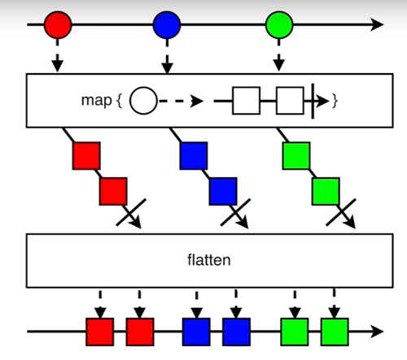
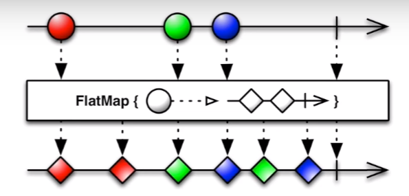
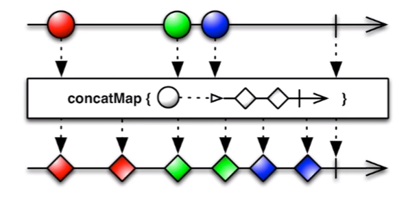
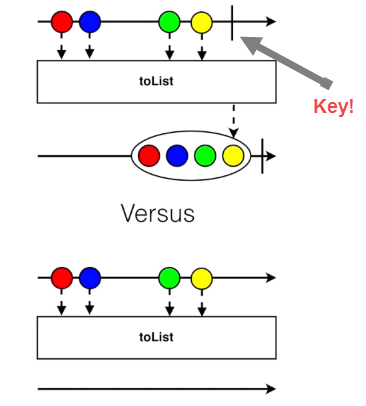
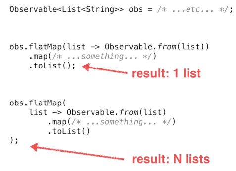

# Common Mistakes

[Presentation Link](https://www.youtube.com/watch?v=QdmkXL7XikQ)

## Creation
```java
Observable<String>observable=Observable.just("Hello");
observable.map(String::length);                           // <--- This will not be part of the stream
observable.subscribe(System.out::println);                // Outputs "Hello"

    // vs.

Observable.just("Hello")
          .map(String::length)
          .subscribe(System.out::println);                // Outputs 5 
```

```java
class MyClass {

	String value;
	
	// BAD! 
	// 1. Doesn't handle unsubscribing
	// 2. Doesn't handle backpressure
	Observable<String> value() {
		return Observable.create(subscriber -> {
			subscriber.onNext(value);
			subscriber.onCompleted();
		});
	}
	
	//Alternatives:
	
	// fromCallable()
	// When someone calls subscribe, run the code in the lambda
	Observable<String> value() {
		return Observable.fromCallable(() -> value); 
	}
	
	// defer()
	Observable<String> value() {
		return Observable.defer(() -> Observable.just(value));
	}
}
```

Difference between `fromCallable()` and `defer()`?
* `fromCallable()` only allows you to return a single value
* With `defer()` you can return any sort of `Observable` and any of the creation methods RxJava provides

Or you could use a `Subject`

```java
class MyClass {
	
	BehaviorSubject<String> value;
	
	Observable<String> value() {
		return value.asObservable();
	}
	
	void setValue(String s) {
		value.onNext(s);
	}
}
```


* DL: "Don't use Subjects, instead use [RxRelay](https://github.com/JakeWharton/RxRelay)
    * Safer subjects
    * "Terminal events kind of suck and break your subjects, RxRelay is
      not susceptible to terminal events"
    
## Operator Misunderstandings

### map() vs flatMap()



Look at the types:

* map: T -> R 
* flatMap: T -> Observable<R>

**Exercise:** 

* Find an API with a search (Marble API, Trello) 
* Query search results via Observable
* Request extra data on results via Observable 
* Challenge: Use only **one** `subscribe()`

### flatMap() vs concatMap()

* Same, except for:
* Order Matters
* flatMap -> **Unordered** merge
* concatMap -> **Ordered** merge




### toList()

* Item(s) -> List<Item>
* "Why does nothing happen?!?"
* Missing onCompleted()



**\*\*It's worth being worried that some operators pay attention to terminal event in order to determine their behavior\*\***

#### List of Lists 

 

### take(1) vs. first()

* take(1) - emits once, or **not at all**
`Observable.empty().take(1)`  <--- Emits nothing

* first() - emits once, or crashes
`Observable.empty().first()`  <--- Crashes


### cache() vs. replay()
* **Don't use** cache()
* **Use** replay()
* cache() == replay().autoConnect(); 

## Custom Operators

* Generally no need to write a custom operator
* Each operator ---> different flow
* Framework handles common flows
* Resort to custom operators for unique flows

## Threading

Which thread does this sequence emit on?
```java
class RxThreading {

    public static void main(String[] args){
        Observable.range(0, 5).subscribe();                     // Current Thread
        
        Observable.interval(1, TimeUnit.SECONDS).subscribe();   // computation()
        
        Observable.just("Hello").subscribe();                   // Current Thread
    }

}
```

```java
class SubscribeOnVsObserveOn {

    public static void main(String[] args){
        
        Observable.just("Hello")                                // io()
                  .subscribeOn(Schedulers.io())
                  .map(/*some mapping operation */)             // io()
                  .subscribeOn(Schedulers.computation())
                  .subscribe();                                 // io()
          
        Observable.just("Hello")                                // Current Thread
                  .observeOn(Schedulers.io())
                  .map(/*some mapping operation */)             // io()
                  .observeOn(Schedulers.computation())
                  .subscribe();                                 // computation()
    }

}
```
* `subscribeOn()`
    * "The general understanding of `subscribeOn()` is that it effects things **upstream**"
    * Multiple `subscribeOn()` calls don't work-- first one wins
* `observeOn()`
    * "The general understanding of `observeOn()` is that it effects things **downstream**"
    * Multiple `observeOn()`'s? No problem? 

## `Subscriptions`

* `Observer` is an **interface**
* `Subscriber` is a **class**
    * `Subscriber` implements `Observer`
* So... what? 
    * `Observer` is **stateless**
    * `Subscriber` is **stateful**
* `Subscriptions` can leak!
    * Detect w/ LeakCanary
    * Solution: Unsubscribe 

### `CompositeSubscription`

* Two ways to unsubscribe with `CompositeSubscription`:
    * `compositeSubscription.clear();`
        * Use this one! 
        * Reusable 
    * `compositeSubscription.unsubscribe();`
        * `CompositeSubscription` is unusable after calling `unsubscribe()`
        * No longer accepts anything new

### RxLifecycle

* Automatic sequence completion
* Activity/Fragment based that naturally unsubscribes in `onPause()`
* Still have the option to manually handle the `subscription`
* Usage Example:

```java
Observable.interval(1, TimeUnit.SECONDS)
          .compose(bindToLifecycle()
          .subscribe(); 
```

## Error Handling

* `onError()` Uses
    * Unexpected exceptions
    * Unrecoverable streams
    * ~~Flow control~~ <-- Blame RetroFit 1
* Terminal events suck
* `onError()` == `try-catch`
    * Don't use `try-catch` for flow control
    * Same applies to `onError()`

### Exceptions Workarounds

* Maintain an Error State within the object that you are working with
    * Don't break the stream, query the object for it's state
* `onErrorReturn()` -- Converts `onError()` into `onNext()` single event
* `onErrorResumeNext()` -- Converts `onError()` into `onNext()` with an `Observable` of events 

### Debugging `onError()`
```java
Observable.empty()
          .first()
          .subscribeOn(Schedulers.io())
          .subscribe(); 
```

This causes RxJava to explode with no references to your own code, just cryptic, "Add `onError()` handling"

#### Implement `onError()`
```java
Observable.empty()
          .first()
          .subscribeOn(Schedulers.io())
          .subscribe(next -> System.out.println(o),
                      err -> throw new OnErrorNotImplementedException("Source!", err)); 
```

Now you'll get a reference to your own code when shit blows up... 

