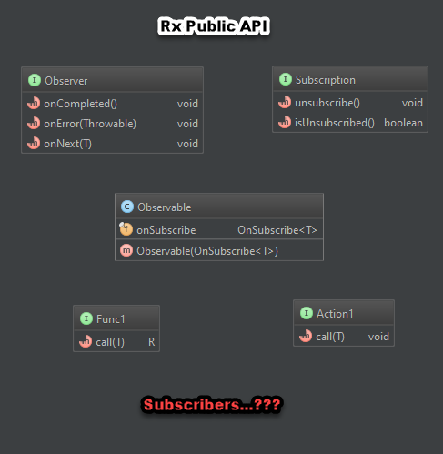
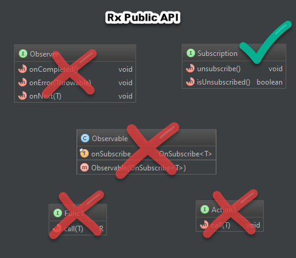

# Demystifying RxJava Subscribers

[Presentation Link](https://www.youtube.com/watch?v=NVKmyK6sd-Q)

Basic idea of Reactive Streams:
> Duality of the Iterator: Rather than iterating over some data that is
> represented in something like a list or an array, where we are pulling
> data out of that iterator, we get the data pushed into us via a
> callback mechanism. 

<br>

| `Iterator<E>`        | `Observer<T>`               |
|----------------------|-----------------------------|
| `E next();`          | `void onNext(T item);`      |
| `boolean hasNext()`* | `void onCompleted();`       |
| `E next()`**         | `void onError(Throwable t)` |
*`hasNext() = false` == `onCompleted()`
**`next() throws NoSuchElementException` == `onError()`

 
### RxJava Public API: The Players

**`Observable:`**

* Represents a stream of data
* Mechanism through which data gets pushed into the callbacks
* High-level methods allow you to combine, deconstruct, compose, etc.
  etc. that allow you to create the data that you want

**`Observer:`**

* Provides a mechanism for receiving push-based notifications.
* After an Observer calls an Observable's subscribe method, the
  Observable calls the Observer's onNext method to provide
  notifications.
* A well-behaved Observable will call an Observer's onCompleted method
  exactly once or the Observer's onError method exactly once.

**`Subscription:`**

* Provides a mechanism that controls whether or not you keep receiving
  data from the stream
* `unsubscribe():` Allows unregistering a Subscriber before it has
  finished receiving all events (i.e, before `onCompleted()` is called)

**`Action1:`**

* `Action1<T>` can serve as a simplified version of `Observer`, where all you care about is the data (i.e., only `onNext()`, **__not__** `onCompleted()` or `onError())`
* Can be used to compose all aspects of an `Observer`
* Used for various side effects (i.e, logging)
* Has a bunch of friends
    * `Action0<T>`...`Action9<T>`
    * `ActionN<T>`

**`Func1<T,R>:`**

* Used in the public API to transform values (i.e., `map()`)
* Similar to `Action<T>`, has a bunch of friends:
    * `Func0<T>`...`Func9<T>`
    * `FuncN<T>`



`Subscriber` is the fundamental building block of RxJava, yet it doesn't
really show up in the Public API

* End-users create/pass in `Action1<T>` and `Func1<T>`, so no
  `Subscriber` there
* `Observable<T>` itself just has a bunch of high-level methods, doesn't
  have anything to do with `Subscriber` 
* `Observer<T>` is the callback that we create in order for data to be
  pushed in to us, also not a `Subscriber`
<br>



<br>
[Lots of ways to Subscribe](VariousWaysToSubscribe.md), but for now, we only care about obtaining a `Subscription`, 
so we'll subscribe with no callback, which will just run the stream even though we can't get any data out

#### Main Example: Part 1--

```java
Observable<String> observable = Observable.just("Hi!");

Subscription subscription = observable.subscribe(); 

System.out.println(subscriber);
```

Outputs: 
> rx.observers.SafeSubscriber@677327b6

So what is a `SafeSubscriber`? 

```java
/**
 * SafeSubscriber is a wrapper around Subscriber that ensures that the Subscriber
 * complies with the Observable contract.
 */
public class SafeSubscriber<T> extends Subscriber<T> {

    private final Subscriber<? super T> actual;

    /**
     * Returns the Subscriber that was used to create this SafeSubscriber}
     */
    public Subscriber<? super T> getActual() {
        return actual;
    }
}
```

Okay... So `SafeSubscriber` is just a wrapper around a `Subscriber` 

The question remains: What is a `Subscriber`?

```java
/**
 * Provides a mechanism for receiving push-based notifications from Observables, 
 * and permits manual unsubscribing from these Observables.
 */
public abstract class Subscriber<T> implements Observer<T>, Subscription {

    Subscriber();
    Subscriber(Subscriber<?> subscriber);

    void add(Subscription subscription);

    void onStart();

    void setProducer(Producer producer);

    protected void request(long n);
    
}
```
 
 A `Subscriber` is both an `Observable<T>` and a `Subscription`, which means it has:
 
 * `onNext();`
 * `onCompleted();`
 * `onError();` 
 * `unsubscribe();`
 * `isUnsubscribed();`
 
A `Subscriber` is _both_ the mechanism for receiving notifications from a stream,
 as well as the mechanism for `unsubscribing` from the stream.  This is why `Subscriber` is _the_ most 
 important type   
 
#### Main Example: Part 2--

```java
Observable<String> observable = Observable.just("Hi!");

Subscription subscription = observable.subscribe(); 

System.out.println(subscriber);

SafeSubscriber<?> safeSubscriber = (SafeSubscriber<?>) subscription;

System.out.println(safeSubscriber.getActual());
```

Outputs: 
> rx.observers.SafeSubscriber@677327b6
> rx.internal.util.ActionSubscriber@14ae5a5

#### Main Example: Part 3--

```java
Observable<String> observable = Observable.just("Hi!");
Subscriber<String> subscriber = new Subscriber<String>() {
    @Override public void onCompleted() {}

    @Override public void onError(Throwable e) {}

    @Override
    public void onNext(String item) {
        System.out.println("Item: " + item);
    }
};
System.out.println(subscriber);

Subscription subscription = observable.subscribe(subscriber);
SafeSubscriber<?> safeSubscriber = (SafeSubscriber<?>) subscription;
System.out.println(safeSubscriber.getActual());
```

Outputs: 
> Main.DemystifyingSubscribers$1@677327b6
> Item: Hi!
> reactive_sum.DemystifyingSubscribers$1@677327b6

The consumer of a stream is always a `Subscriber<T>`

* Might be wrapping an `Observer<T>`, `Action1<T>`, or just empty
* Always wrapped in `SafeSubscriber<T>` to ensure/enforce contract
    * `onNext()` can be called 0...N times
    * `onCompleted()` || `onError()` only called once

